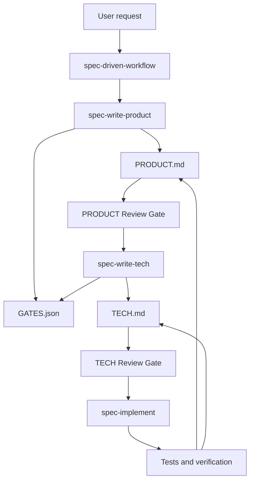

# Spec-Driven Development

<p align="center">
  <strong>Portable agent skills for product-first, gated, spec-driven feature delivery.</strong>
</p>

<p align="center">
  <a href="https://github.com/ai-x-builder/Spec-Driven-Development/blob/main/LICENSE"></a>
  
  
  
</p>

<p align="center">
  <a href="#features">Features</a> ·
  <a href="#quick-start">Quick Start</a> ·
  <a href="#usage">Usage</a> ·
  <a href="#architecture">Architecture</a> ·
  <a href="#contributing">Contributing</a>
</p>

---

## Overview

`Spec-Driven Development` is a portable skill pack for engineers and agent operators who want substantial work to move through explicit product and technical review gates before implementation.

It installs globally into `~/.agents/skills/` and can be used by skill-compatible coding agents and CLIs including Claude Code, OpenClaw, Codex, Cursor, Droid, Gemini CLI, and GitHub Copilot.

It helps users reduce ambiguous agent-driven implementation by requiring a reviewed `PRODUCT.md`, a derived `TECH.md`, and a minimal checked-in `GATES.json` before code changes begin.

### Why this project exists

Most agent workflows rely on conversation history, ad hoc planning, or implementation-first iteration. That makes it easy for product intent, technical assumptions, and review state to drift.

`Spec-Driven Development` focuses on:

- **Product behavior first** — user-visible behavior is captured in numbered, testable invariants before technical planning starts.
- **Explicit review gates** — PRODUCT and TECH approvals are tracked in `GATES.json`, so future agents can see whether a phase is ready.
- **Living specs** — product and tech specs stay in source control and are updated when implementation changes the agreed behavior or plan.

### Demo

```text
User request
   |
   v
specs-driven/<id>/PRODUCT.md
   |
   v
PRODUCT Review Gate -> GATES.json product.status = approved
   |
   v
specs-driven/<id>/TECH.md
   |
   v
TECH Review Gate -> GATES.json tech.status = approved
   |
   v
Implementation and verification
```

---

## Features

- [x] **Staged spec workflow** — decide whether specs are needed, then move through PRODUCT, TECH, implementation, and verification in order.
- [x] **Behavior-first product specs** — write `PRODUCT.md` as stable numbered invariants without implementation details.
- [x] **Grounded technical specs** — write `TECH.md` from approved product behavior and current codebase research.
- [x] **Gate status tracking** — persist review state in a minimal `GATES.json` file per spec directory.
- [ ] **Automated validation helpers** — future scripts could lint spec directories and gate state consistency.

---

## Use Cases

`Spec-Driven Development` is useful when you want to:

1. Ask an AI coding agent to implement a substantial feature without losing product intent.
2. Review product behavior before technical planning begins.
3. Keep implementation plans, risks, and validation mapped back to explicit behavior requirements.
4. Resume work across agent sessions using checked-in specs instead of conversation memory alone.

---

## Quick Start

### Prerequisites

Before you begin, make sure you have:

- Node.js with `npx`.
- A skill-compatible agent or CLI, such as Claude Code, OpenClaw, Codex, Cursor, Droid, Gemini CLI, or GitHub Copilot.

### Installation

```bash
npx skills add ai-x-builder/Spec-Driven-Development -y -g
```

The `-g` flag installs these skills globally under `~/.agents/skills/`, where supported agents can discover and use them.

### Run locally

There is no build step or server. After installation, start a new session in your agent of choice and invoke the workflow naturally, for example:

```text
Use spec-driven workflow for this feature.
```

---

## Usage

### Basic usage

Ask your coding agent to use the workflow for a substantial feature:

```text
Use spec-driven workflow to design and implement saved report filters.
```

The workflow will decide whether the change warrants specs. If it does, it creates:

```text
specs-driven/<id>/PRODUCT.md
specs-driven/<id>/TECH.md
specs-driven/<id>/GATES.json
```

### Example

```text
Use spec-driven workflow for a new CSV export feature.
```

Expected flow:

```text
1. Write PRODUCT.md and stop at PRODUCT Review Gate.
2. After approval, write TECH.md and stop at TECH Review Gate.
3. After approval, implement and verify against both specs.
4. Keep PRODUCT.md, TECH.md, and GATES.json current if decisions change.
```

### Gate state

Each active spec directory uses this minimal gate file:

```json
{
  "version": 1,
  "product": {
    "status": "pending"
  },
  "tech": {
    "status": "pending"
  }
}
```

Only `pending` and `approved` are valid status values.

---

## Documentation

Primary documentation lives in the skills themselves:

- [spec-driven-workflow](./skills/spec-driven-workflow/SKILL.md)
- [spec-write-product](./skills/spec-write-product/SKILL.md)
- [spec-write-tech](./skills/spec-write-tech/SKILL.md)
- [spec-implement](./skills/spec-implement/SKILL.md)

Example specs live in [specs-driven](./specs-driven).

---

## Architecture



### Core modules

| Module | Responsibility |
| --- | --- |
| `skills/spec-driven-workflow` | Orchestrates intake, spec necessity, review gates, implementation readiness, and spec synchronization. |
| `skills/spec-write-product` | Produces behavior-first `PRODUCT.md` files and manages PRODUCT Review Gate handoff. |
| `skills/spec-write-tech` | Produces implementation-oriented `TECH.md` files from approved product specs. |
| `skills/spec-implement` | Implements only after both gates pass and keeps specs aligned with shipped behavior. |
| `specs-driven` | Stores checked-in product specs, tech specs, and gate-state examples by feature id. |

---

## Project Structure

```text
.
├── skills/
│   ├── spec-driven-workflow/
│   ├── spec-write-product/
│   ├── spec-write-tech/
│   └── spec-implement/
├── specs-driven/
│   └── <feature-id>/
│       ├── PRODUCT.md
│       ├── TECH.md
│       └── GATES.json
├── README-TEMPLATE.md
├── README.md
└── LICENSE
```

---

## Development

### Install dependencies

No package dependencies are required.

### Run checks

```bash
find skills specs-driven -name '*.md' -print
find specs-driven -name 'GATES.json' -exec jq . {} \;
git diff --check
```

### Build

No build artifact is produced. The repository ships Markdown skill instructions and example specs.

---

## Roadmap

- [ ] Add a lightweight spec directory linter.
- [ ] Add more end-to-end examples for common feature shapes.
- [ ] Document upgrade guidance for existing teams adopting the workflow.

See [open issues](https://github.com/ai-x-builder/Spec-Driven-Development/issues) for proposed features and known issues.

---

## Comparison

| Project | Focus | Strength | Limitation |
| --- | --- | --- | --- |
| `Spec-Driven Development` | Gated agent skill workflow | Keeps product behavior, technical plans, and gate state in source control. | Requires human review signals before later phases. |
| Conversation-only planning | Fast informal coordination | Low ceremony for tiny changes. | Easy to lose decisions across sessions. |
| Traditional PRD templates | Product planning | Familiar for teams and stakeholders. | Often disconnected from agent execution and codebase validation. |

---

## Contributing

Contributions are welcome.

To contribute:

1. Fork this repository.
2. Create a feature branch:

   ```bash
   git checkout -b feature/<feature-name>
   ```

3. Commit your changes:

   ```bash
   git commit -m "feat: add <feature-name>"
   ```

4. Push to your branch:

   ```bash
   git push origin feature/<feature-name>
   ```

5. Open a Pull Request.

---

## Code of Conduct

Please keep discussions respectful, specific, and focused on improving the workflow.

---

## Security

If you discover a security concern, please do **not** open a public issue with exploit details. Contact the maintainer through the repository owner profile or open a minimal private disclosure path if one is available.

---

## Changelog

Release history is currently tracked through git commits.

---

## Maintainers

- [ai-x-builder](https://github.com/ai-x-builder)

---

## Acknowledgements

Thanks to:

- The broader agent skills ecosystem.
- Review-gated software delivery practices.
- Everyone improving agent workflows through checked-in, reviewable context.

---

## License

Distributed under the MIT License.

See [LICENSE](./LICENSE) for more information.
